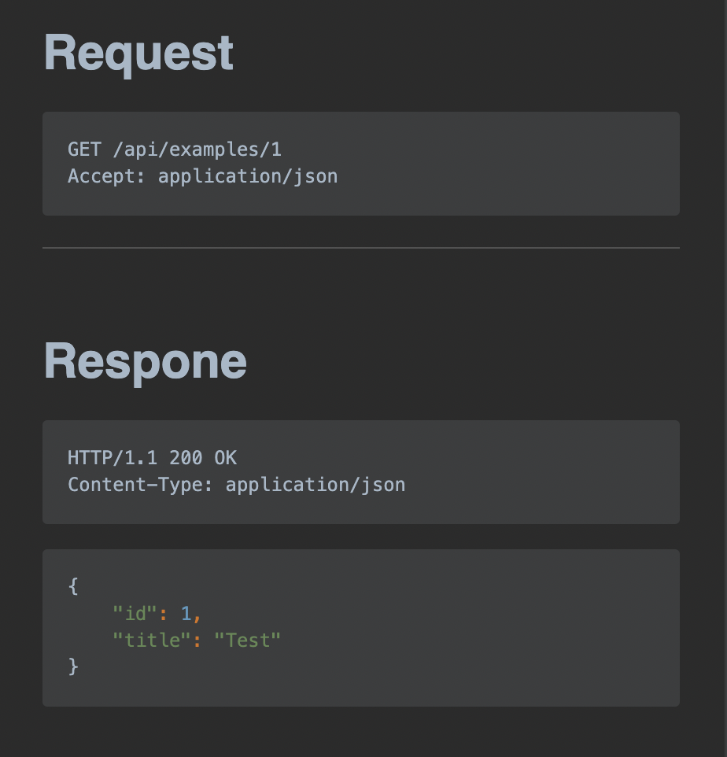
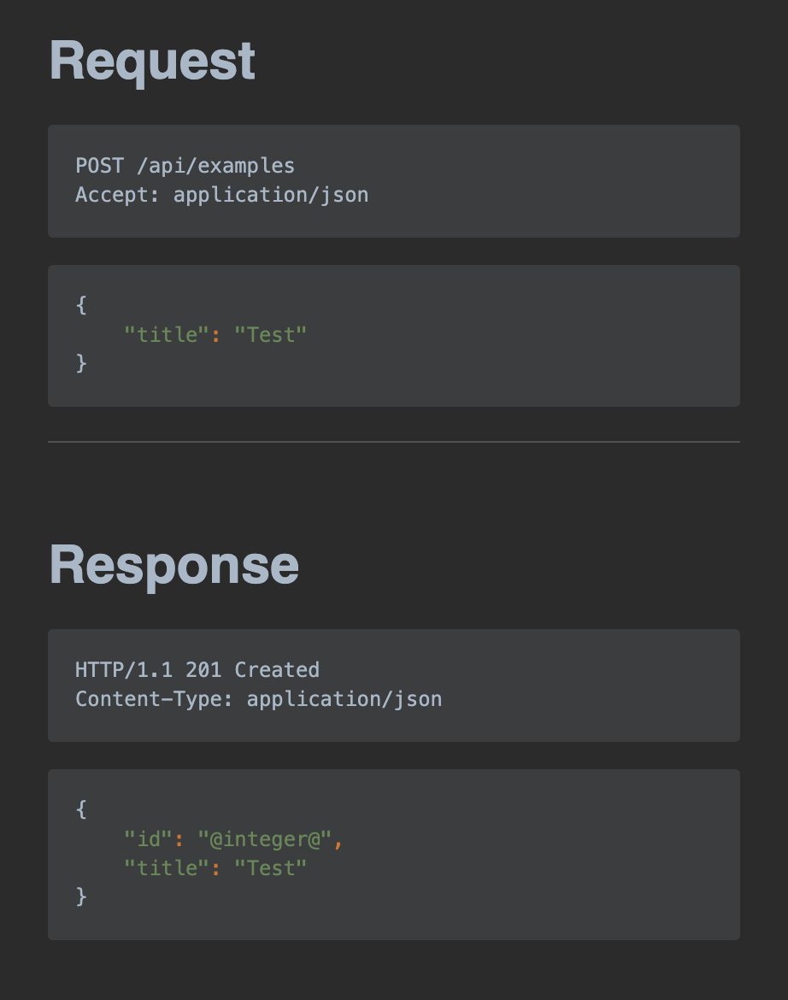
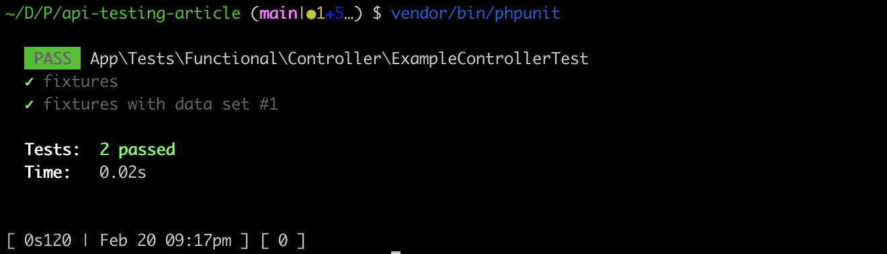
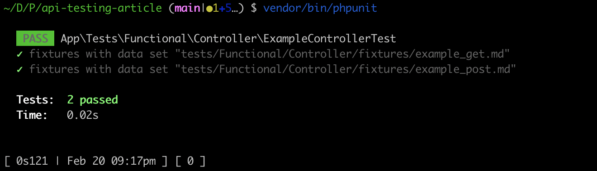

# Testing APIs using Markdown and PHP Matcher

My experience is that almost every API tests follow the same workflow. 
Fixtures are loaded in setupBeforeClass or maybe in a bootstrap file of
your test framework. A request is send and the response should match.

In the last projects I did match the response content against an own `.json` 
file for my tests. But in this case I need to adopt the request in my
Test file but the expected result is in another own `.json` file, which
did make the maintainance a little bit difficult sometimes, to find
the correct `.json` file for the correct test case.

After I did stumble over the test cases in the [rectorphp](https://github.com/rectorphp/rector-src/pull/1668/files).
I was thinking about how I could adopt this also for APIs to get my API
tests in a format which removes the whole boilerplate of creating the tests
and have the request and response in the same file.

## Creating a framework independent format

First I was thinking about moving all into a json format like the following:

```json
{
    "request": {
        "method": "GET",
        "uri": "/api/examples/1",
        "headers": {
            "Accept": "application/json"
        }
    },
    "response": {
        "method": "GET",
        "uri": "/api/examples/1",
        "content": "/api/examples/1",
        "headers": {
            "Accept": "application/json"
        }
    }
}
```

But I think that the JSON format is not very readable and JSON has the
disadvantage that we can not add any comment to it.

So I did think about using markdown flavoured format for this:

~~~md
# Request

```http request
POST /api/examples
Accept: application/json

{
    "title": "Test"
}
```

---

# Response

```http request
HTTP/1.1 200 OK
Content-Type: application/json

{
    "id": "@int@",
    "title": "Test"
}
```
~~~

Why at first place the format is really great because it matches
the HTTP protocol it has one downside. The downside is the autocomplete
and code highlighting of the JSON in the IDE. So to fix that one I
split the content into an own code block of the markdown file:

~~~
# Request

```http request
POST /api/examples
Accept: application/json
```

```json
{
    "title": "Test"
}
```

---

# Response

```http request
HTTP/1.1 200 OK
Content-Type: application/json
```

```json
{
    "id": "1",
    "title": "Test"
}
```
~~~

Now we have the format how we want to write tests, now it come the part to implement
it that we can use it.

## Creating a basic test case

To create our basic test case we first need a method to read our markdown files.
We will use here the [symfony/finder](https://symfony.com/doc/current/components/finder.html)
component to read the only files we need.

```php
<?php

namespace App\Tests\Functional;

use Symfony\Bundle\FrameworkBundle\Test\WebTestCase;
use Symfony\Component\Finder\Finder;

abstract class AbstractApiTest extends WebTestCase
{
    /**
     * @return \Generator<\SplFileInfo>
     */
    protected function yieldFilesFromDirectory(string $directory): \Generator
    {
        $finder = new Finder();
        $finder->in($directory)
            ->ignoreVCS(true)
            ->files()
            ->name('*.md');

        foreach ($finder as $file) {
            if ($file instanceof \SplFileInfo) {
                yield [$file];
            }
        }
    }
}
```

Now we need to add also a method to parse the markdown file and make our expected
assertions by them:

```php
protected function doTestFileInfo(\SplFileInfo $fileInfo): void
{
    // arrange
    $content = \file_get_contents($fileInfo->getPathname());

    [$input, $output] = \explode("\n---\n", $content);

    [$method, $uri, $headers, $content] = $this->parseRequest($input);
    [$expectedServerProtocol, $expectedStatusCode, $expectedHeaders, $expectedContent] = $this->parseResponse($output);

    /** @var array<string, string> $server */
    $server = [];
    foreach ($headers as $key => $value) {
        $servers['HTTP_' . strtoupper(str_replace('-', '_', $key))] = $value;
    }

    // act
    $client = $this->createClient();
    $client->request($method, $uri, [], [], $server, $content);

    // assert
    $response = $client->getResponse();

    $this->assertSame($expectedServerProtocol, $response->getProtocolVersion());
    $this->assertSame($expectedStatusCode, $response->getStatusCode());
    foreach ($expectedHeaders as $headerName => $expectedHeaderValue) {
        $this->assertSame($expectedHeaderValue, $response->headers->get($headerName));
    }
    $this->assertSame($expectedContent, $response->getContent());
}
```

The markdown file I did parse quickly with a regex to get out the information
I needed.

<details>
    <summary>parseRequest Function</summary>

```php
/**
 * @return array{
 *     0: string,
 *     1: string,
 *     2: array<string, string>,
 *     3: string,
 * }
 */
private function parseRequest(string $input): array
{
    preg_match('/```http request\n(\w+) (.+)\n([^```]*)```([^```]*```\w+\n([^```]*)```)?/', $input, $matches);
    $method = $matches[1];
    $uri = $matches[2];
    $headerString = $matches[3];
    $content = $matches[5] ?? '';

    $headers = [];
    $headerParts = array_filter(explode("\n", $headerString));
    foreach ($headerParts as $headerPart) {
        [$headerName, $headerValue] = \explode(':', $headerPart, 2);
        $headers[trim($headerName)] = trim($headerValue);
    }

    return [$method, $uri, $headers, $content];
}
```    

</details>

<details>
    <summary>parseResponse Function</summary>

```php
/**
 * @return array{
 *     0: string,
 *     1: int,
 *     2: array<string, string>,
 *     3: string,
 * }
 */
private function parseResponse(string $output): array
{
    preg_match('/```http request\n\w+\/(\d+.\d+) (\d+) \w+\n([^```]*)```([^```]*```\w+\n([^```]*)```)?/', $output, $matches);
    $serverProtocol = $matches[1];
    $statusCode = (int) $matches[2];
    $headerString = $matches[3];
    $content = $matches[5] ?? '';

    $headers = [];
    $headerParts = array_filter(explode("\n", $headerString));
    foreach ($headerParts as $headerPart) {
        [$headerName, $headerValue] = \explode(':', $headerPart, 2);
        $headers[trim($headerName)] = trim($headerValue);
    }

    return [$serverProtocol, $statusCode, $headers, $content];
}
```    

</details>

And then used the parsed data to send the request over the symfony
web test case. The parsed data of the response is used for the assertions
against the response object. We are matching here all relevant data
the Protocol Version, Status Code, Headers and Content.

Now we can use our `AbstractApiTest` in our own Test by testing our rest endpoint:

```php
<?php

namespace App\Tests\Functional\Controller;

use App\Tests\Functional\AbstractApiTest;

class ExampleControllerTest extends AbstractApiTest
{
    /**
     * @dataProvider provideData()
     */
    public function testFixtures(\SplFileInfo $fileInfo): void
    {
        $this->doTestFileInfo($fileInfo);
    }

    /**
     * @return \Generator<\SplFileInfo>
     */
    public function provideData(): \Generator
    {
        return $this->yieldFilesFromDirectory(__DIR__ . '/fixtures');
    }
}
```

In the testMethod itself or in the `setupBeforeClass` class you even could still
make sure that you are loading some database fixtures which are required for your test case.

Now we can create our test cases in our markdown files like the followings:

<p>
<a href="tests/Functional/Controller/fixtures/example_get.md">
    
</a>
</p>

<p>
<a href="tests/Functional/Controller/fixtures/example_post.md">
    
</a>
</p>

I think it is really nice as it forces the developer to work in 
a format based on the HTTP Protocol Standard.

## Fix problem with dynamic response content

While it is hard when you example work with date times,
auto generated ids to exact match the response against a json. 
There is a solution for this by using the [coduo php matcher](https://github.com/coduo/php-matcher).

This library allows you to write something like:

```json
{
    "id": "@integer@",
    "text": "@string@.startsWith('Test')"
}
```

To use expression or type matching instead of exact matching.

So instead of:

```php
$this->assertSame($expectedContent, $response->getContent());
```

```php
$this->assertMatchesPattern($expectedContent, $response->getContent());
```

From the `Coduo\PHPMatcher\PHPUnit\PHPMatcherAssertions` Trait.

This way we can use [all coduo patterns](https://github.com/coduo/php-matcher#available-patterns)
inside our response content.

## Optimizing the output format in PHPUnit

I personally prefer to use the [`nunomaduro\collision`](https://github.com/nunomaduro/collision) package
as a printer for my PHPUnit tests. As it output the tests 
in a nice readable way:



Still it does not indicate here a lot but with a little change in our
API Testcase by using a key in our test generator this way:

```diff
-yield [$file];
+yield \str_replace(\getcwd() . '/', '', $file->getPathname()) => [$file];
```

It will output us the test in the following format:



Now the nice thing is as we are using the path from `getcwd()` (current directory)
we can directly in our terminal click on the `.md` file path to open the
test case file and adopt it to our needs when required.

By using that the filename as key it is now also possible to filter by that specific
test case via phpunit:

```bash
vendor/bin/phpunt --filter="example_post.md"
```

This way only the `example_post.md` is exectued.

## Conclusion

With the usage of a more general format we did got ride of a lot of boilerplate
code for our api tests. With the usage of markdown files we even make it possible
to better document our test cases as we could add test for them.
Also I like to use the response and request format of the official http standard.

The tests could also be even ported to another framework if the framework of your
application is changing or even to another language, there you would just need
to reimplement your base test case again.

Also if you don't want to use markdown files I can recommend using the
[coduo/php-matcher](https://github.com/coduo/php-matcher) instead of manual
matching your response data. Because your tests should also fail if you are
adding a new key to your response object. So you are sure that new added keys
are also added to your test cases.

If you want to test it yourself feel free to clone this repository and run and adopt its tests:

```bash
git clone https://github.com/alexander-schranz/markdown-based-api-testing
composer install
vendor/bin/phpunit
```

Let me know what you think about this way of testing your api. Maybe you know
exist API test frameworks which work the similar way.

Attend the discussion about this on [Twitter](https://twitter.com/alex_s_/status/1495503991429554181).
